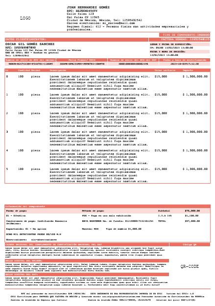

## Factura de uan sola página

### Solo una pagina por factura
( Oportunidad para hacerla multipagina )
```bash

url:     /factura
Router:  Route::get('/factura', [FacturaController::class, "gen_factura"]);
view:    resources/views/template/pdf_factura.blade.php
Controller: /app/Http/Controllers/FacturaController.php
Clase_usada: /app/Clases/Mpdf.php

```




