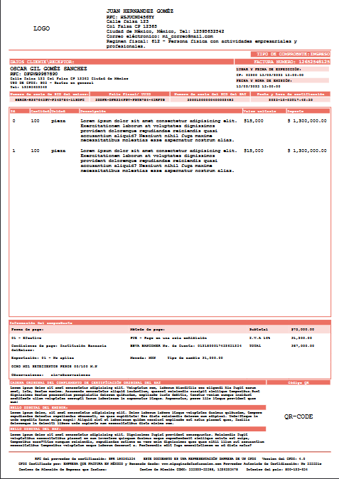

## Orden de pago de una sola página

```bash

url:     /orden_pago
Router: Route::get('/orden_pago', [OrdenPago::class, "genera_orden"]);
view:   resources/views/template/pdf_orden_de_pago.blade.php
Controller:  app/Http/Controllers/OrdenPago.php
Clase_usada: /app/Clases/Mpdf.php

```


## Membretada

```bash  

url:     /membretada
Router: Route::get('/membretada', [MembretadaController::class, 'gen_membretada']);
view:   resources/views/template/pdf_membreatda.blade.php
Controller:  app/Http/Controllers/MembretadaController.php
Clase_usada: /app/Clases/Mpdf.php

```


## Credencial - Portrait 5.4cm X 8.6cm

```bash  

url:     /credencial
Router: Route::get('/credencial', [CredencialController::class, 'gen_credencial']);
view:   resources/views/template/pdf_credencial.blade.php
Controller:  app/Http/Controllers/CredencialController.php
Clase_usada: /app/Clases/Mpdf.php

```


## Factura de una sola página

### Solo una pagina por factura
( Oportunidad para hacerla multipagina )
```bash

url:     /factura
Router:  Route::get('/factura', [FacturaController::class, "gen_factura"]);
view:    resources/views/template/pdf_factura.blade.php
Controller: /app/Http/Controllers/FacturaController.php
Clase_usada: /app/Clases/Mpdf.php

```


