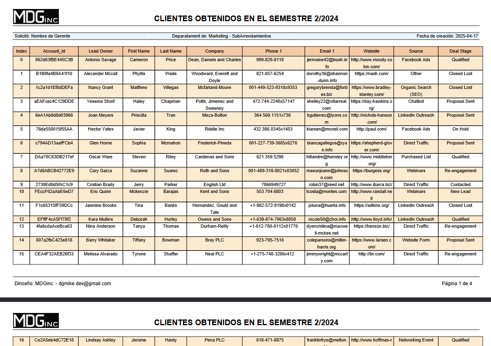

# FPDF ES UNA LIBRERÍA PARA GENERAR PDF DE MANERA PROGRAMÁTICA

# TFPDF ES UNA EXTENSIÓN DE LA LIBRERÍA ( FPDF )

## SOLO QUE EN ESTA EXTENSIÓN SE PUEDE USAR ACENTOS Y LAS LETRAS Ñ
## YA QUE TIENE SOPORTE UTF-8

INSTALACIÓN:

1 - INSTALACIÓN DE FPDF VÍA COPOSER:  composer require fpdf/fpdf

ESTO INSTALARÁ LA LIBRERÍA EN LA CARPETA VENDOR


2 - se integran las fuciones para generar tablas con MultiCell al final de la clase fpdf

```php

/////////////////////////////////////////////////////////////////////////////////
//																			                                     ////
// SE ADICIONAN LAS FUNCIONES PARA QUE SE PUEDA HACER UNA FILA CON MultiCell ////
// 																		                                    	 ////
/////////////////////////////////////////////////////////////////////////////////

function SetWidths($w)
{
	// Set the array of column widths
	$this->widths = $w;
}

function SetAligns($a)
{
	// Set the array of column alignments
	$this->aligns = $a;
}

function Row($data, $fillR=false, $aligns='L')
{
	// si se quiere rellenar el row de color
	if ($fillR){
		$fillR = 'DF';
	}else{
		$fillR = 'D';
	}

	// Calculate the height of the row
	$nb = 0;
	for($i=0;$i<count($data);$i++)
		$nb = max($nb,$this->NbLines($this->widths[$i],$data[$i]));
	$h = 5*$nb;
	// Issue a page break first if needed
	$this->CheckPageBreak($h);
	// Draw the cells of the row
	for($i=0;$i<count($data);$i++)
	{
		$w = $this->widths[$i];
		$a = isset($this->aligns[$i]) ? $this->aligns[$i] : 'C';
		// Save the current position
		$x = $this->GetX();
		$y = $this->GetY();
		// Draw the border
		$this->Rect($x,$y,$w,$h, $fillR);    // Se adiciona $fillR para modificar el llenado de color del rectancgulo del Row generado
		// Print the text
		$this->MultiCell($w,5,$data[$i],0,$a);
		// Put the position to the right of the cell
		$this->SetXY($x+$w,$y);
	}
	// Go to the next line
	$this->Ln($h);
}

function CheckPageBreak($h)
{
	// If the height h would cause an overflow, add a new page immediately
	if($this->GetY()+$h>$this->PageBreakTrigger)
		$this->AddPage($this->CurOrientation);
}

function NbLines($w, $txt)
{
	// Compute the number of lines a MultiCell of width w will take
	if(!isset($this->CurrentFont))
		$this->Error('No font has been set');
	$cw = $this->CurrentFont['cw'];
	if($w==0)
		$w = $this->w-$this->rMargin-$this->x;
	$wmax = ($w-2*$this->cMargin)*1000/$this->FontSize;
	$s = str_replace("\r",'',(string)$txt);
	$nb = strlen($s);
	if($nb>0 && $s[$nb-1]=="\n")
		$nb--;
	$sep = -1;
	$i = 0;
	$j = 0;
	$l = 0;
	$nl = 1;
	while($i<$nb)
	{
		$c = $s[$i];
		if($c=="\n")
		{
			$i++;
			$sep = -1;
			$j = $i;
			$l = 0;
			$nl++;
			continue;
		}
		if($c==' ')
			$sep = $i;
		$l += $cw[$c];
		if($l>$wmax)
		{
			if($sep==-1)
			{
				if($i==$j)
					$i++;
			}
			else
				$i = $sep+1;
			$sep = -1;
			$j = $i;
			$l = 0;
			$nl++;
		}
		else
			$i++;
	}
	return $nl;
}

```


# REPORTE LISTADO 

* Multi Página
* Multi línea en cada fila
* Color en filas




## Version Alternativa para servidores con problemas con utf8

2 - DESCARGAR PAQUETE TFPDF EN : https://www.fpdf.org/en/script/script92.php

2.1 - CREAR UNA CARPETA AL NIVEL DE LAS CARPETAS PUBLIC, DATABASE, APP ETC CON EL NOMBRE "packages"<br>
2.2 - CREAR UNA CARPETA CON NOMBRE DEL PAQUETE EN EL PROYECTO PARA ESTE CASO "utftfpdf"<br>
2.3 - GUARDAR DENTRO DE ESTA CARPETA EL CONTENIDO DESCARGADO EN EL PASO 2<br>
2.4 - EN EL ARCHVIO composer.json DEL PAQUETE COLOCAR EL SIGUIENTE CONTENIDO:<br>

```json
{
    "name": "utftfpdf/tfpdf",
    "description": "tFPDF - FPDF con soporte UTF-8 para Laravel",
    "type": "library",
    "autoload": {
      "classmap": ["."]
    },
    "license": "MIT",
    "minimum-stability": "dev",
    "prefer-stable": true
  }

```
DONDE : "name": "utftfpdf/tfpdf", CONTIENE EL NOMBRE LA CARPETA CONTENEDORA Y EL NOMBRE DE LA CALSE tfpdf.php

3 - EN EL ARCHVIO composer.json DEL PROYECTO HASTA LA PARTE INFERIOR ANTES DEL "}" DE CIERRE COLOCAR EL SIGUIENTE CONTENIDO:

```json
 "repositories": [
        {
            "type": "path",
            "url": "packages/utftfpdf/tfpdf"
        }
    ]
```

4 - CORRER ESTE COMANDO EN COMPOSER:

```bash

composer require utftfpdf/tfpdf:dev-main

```


